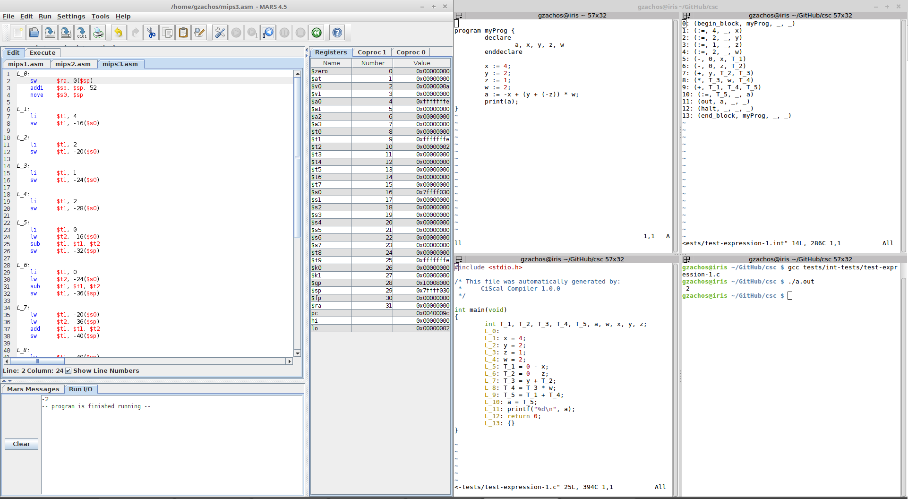
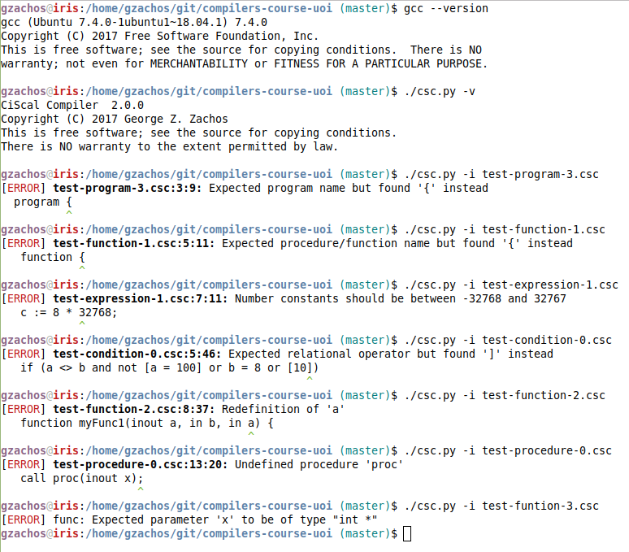

# CiScal Compiler

__CiScal__ is a minimal programming language that has borrowed its characteristics from C and Pascal.
__CiScal Compiler__ (CSC) was developed during the "_CSE802 - Compilers_" course @[cse.uoi.gr](http://cse.uoi.gr)
and the final assembly code targets the MIPS32 architecture.

  * Intermediate code equivalent in ANSI C is ready to compile using GCC (or any other C compiler).
  * Final code is ready to assemble using MARS 4.5 ([MIPS Assembler and Runtime Simulator](http://courses.missouristate.edu/KenVollmar/mars/)).

## Language
Python (v3.5.2)

## Execution
Run: ```./csc.py``` to display usage information.

## Screenshots





## Developer
[George Z. Zachos](https://gzachos.com)

## Licence
[GNU GENERAL PUBLIC LICENSE Version 2, June 1991](LICENSE)
